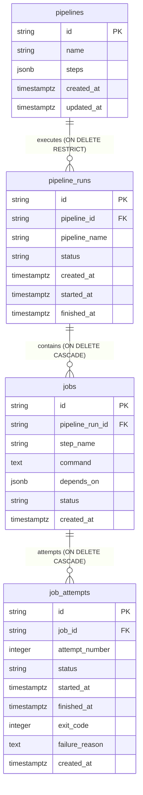

# Forge V2 — PostgreSQL Persistence Architecture

## 1. Overview & Architectural Role

Following **ADR-002 (PostgreSQL as Authoritative Source of Truth)**, PostgreSQL is the sole authoritative durable persistent store for Forge V2.

The persistence architecture enforces strict separation of concerns:

1. **`@forge/pipeline` (Domain Layer)** defines domain entities, DAG resolution, and deterministic state machines. It has **zero knowledge of PostgreSQL, SQL, or drivers**.
2. **Repository Contracts** define typed domain-driven persistence interfaces (`PipelineRepository`, `PipelineRunRepository`, `JobRepository`, `JobAttemptRepository`).
3. **`@forge/database` (Infrastructure Layer)** implements these repository contracts using connection-pooled, parameterized SQL queries against PostgreSQL.
4. **PostgreSQL** guarantees durable, ACID-compliant state storage with referential constraints, indexing, and transactional isolation.

```text
                 @forge/pipeline (Pure Domain)
                       │
                       │ Domain Models & IDs
                       ▼
        Repository Contracts (@forge/database)
                       │
                       │ Implements
                       ▼
        PostgreSQL Repositories (@forge/database)
                       │
                       │ Parameterized SQL
                       ▼
                  PostgreSQL
```

---

## 2. Schema Specification

The database schema is defined and applied entirely through ordered, tracked migrations. The initial schema version is `001_initial_schema`.

### Entity Relationship Diagram



### 2.1 `pipelines` Table

Persists pipeline definitions and step specifications.

| Column       | Type           | Constraints              | Description                                                |
| ------------ | -------------- | ------------------------ | ---------------------------------------------------------- |
| `id`         | `VARCHAR(255)` | `PRIMARY KEY`            | Unique pipeline identifier (e.g. `pipe-ci-build`)          |
| `name`       | `VARCHAR(255)` | `NOT NULL`               | Human-readable pipeline name                               |
| `steps`      | `JSONB`        | `NOT NULL`               | Array of step definitions (`name`, `command`, `dependsOn`) |
| `created_at` | `TIMESTAMPTZ`  | `NOT NULL DEFAULT NOW()` | UTC creation timestamp                                     |
| `updated_at` | `TIMESTAMPTZ`  | `NOT NULL DEFAULT NOW()` | UTC update timestamp                                       |

**Design Decision (Embedded Steps as JSONB)**: Steps represent internal value objects of the `Pipeline` aggregate root. Storing them as structured `JSONB NOT NULL` preserves step ordering, command definitions, and dependency lists atomically without artificial relational normalization or multi-table join overhead.

### 2.2 `pipeline_runs` Table

Persists execution instances of pipelines.

| Column          | Type           | Constraints                                            | Description                               |
| --------------- | -------------- | ------------------------------------------------------ | ----------------------------------------- |
| `id`            | `VARCHAR(255)` | `PRIMARY KEY`                                          | Unique pipeline run identifier            |
| `pipeline_id`   | `VARCHAR(255)` | `NOT NULL REFERENCES pipelines(id) ON DELETE RESTRICT` | Associated pipeline definition            |
| `pipeline_name` | `VARCHAR(255)` | `NOT NULL`                                             | Snapshot of pipeline name at trigger time |
| `status`        | `VARCHAR(50)`  | `NOT NULL, CHECK (status IN (...))`                    | Run lifecycle state                       |
| `created_at`    | `TIMESTAMPTZ`  | `NOT NULL DEFAULT NOW()`                               | Run creation timestamp                    |
| `started_at`    | `TIMESTAMPTZ`  | `NULL`                                                 | Run start timestamp                       |
| `finished_at`   | `TIMESTAMPTZ`  | `NULL`                                                 | Run completion timestamp                  |

**Indexes**:

- `idx_pipeline_runs_pipeline_id ON pipeline_runs(pipeline_id)`
- `idx_pipeline_runs_status ON pipeline_runs(status)`

### 2.3 `jobs` Table

Persists execution nodes corresponding 1:1 to pipeline steps within a pipeline run.

| Column            | Type           | Constraints                                               | Description                          |
| ----------------- | -------------- | --------------------------------------------------------- | ------------------------------------ |
| `id`              | `VARCHAR(255)` | `PRIMARY KEY`                                             | Unique job identifier                |
| `pipeline_run_id` | `VARCHAR(255)` | `NOT NULL REFERENCES pipeline_runs(id) ON DELETE CASCADE` | Associated pipeline run              |
| `step_name`       | `VARCHAR(255)` | `NOT NULL`                                                | Step name within pipeline definition |
| `command`         | `TEXT`         | `NOT NULL`                                                | Shell command to execute             |
| `depends_on`      | `JSONB`        | `NOT NULL DEFAULT '[]'`                                   | Prerequisite step names              |
| `status`          | `VARCHAR(50)`  | `NOT NULL, CHECK (status IN (...))`                       | Job lifecycle state                  |
| `created_at`      | `TIMESTAMPTZ`  | `NOT NULL DEFAULT NOW()`                                  | Job creation timestamp               |

**Constraints & Invariants**:

- `CONSTRAINT uq_jobs_run_step UNIQUE (pipeline_run_id, step_name)`: Enforces the core PR 03 invariant that each pipeline step corresponds to exactly one job per pipeline run.
- `idx_jobs_pipeline_run_id ON jobs(pipeline_run_id)`
- `idx_jobs_status ON jobs(status)`

### 2.4 `job_attempts` Table

Persists physical execution attempts of jobs.

| Column           | Type           | Constraints                                      | Description                                         |
| ---------------- | -------------- | ------------------------------------------------ | --------------------------------------------------- |
| `id`             | `VARCHAR(255)` | `PRIMARY KEY`                                    | Unique attempt identifier                           |
| `job_id`         | `VARCHAR(255)` | `NOT NULL REFERENCES jobs(id) ON DELETE CASCADE` | Associated job                                      |
| `attempt_number` | `INTEGER`      | `NOT NULL CHECK (attempt_number >= 1)`           | 1-based attempt sequence number                     |
| `status`         | `VARCHAR(50)`  | `NOT NULL, CHECK (status IN (...))`              | Attempt lifecycle state                             |
| `started_at`     | `TIMESTAMPTZ`  | `NULL`                                           | Attempt start timestamp                             |
| `finished_at`    | `TIMESTAMPTZ`  | `NULL`                                           | Attempt finish timestamp                            |
| `exit_code`      | `INTEGER`      | `NULL`                                           | Process exit code (e.g. 0 on success, 1 on failure) |
| `failure_reason` | `TEXT`         | `NULL`                                           | Error or timeout message                            |
| `created_at`     | `TIMESTAMPTZ`  | `NOT NULL DEFAULT NOW()`                         | Attempt creation timestamp                          |

**Constraints & Invariants**:

- `CONSTRAINT uq_job_attempts_job_number UNIQUE (job_id, attempt_number)`: Enforces that attempt numbers for a job are unique and historical attempts (attempt 1, attempt 2, etc.) are immutably preserved.
- `idx_job_attempts_job_id ON job_attempts(job_id)`

---

## 3. Migration Strategy

The migration runner is located in `packages/database/src/migrations/migrator.ts`.

- **Migration Tracking**: The `forge_migrations` table records applied migrations by unique name and application timestamp.
- **Transactional Execution**: Each migration runs inside an atomic transaction block (`BEGIN` ... `COMMIT`). If a migration fails, it rolls back automatically (`ROLLBACK`) and raises a `MigrationError`.
- **Clean Bootstrap**: When running against an empty database, running `runMigrations(pool)` applies all migrations in ascending order.
- **Idempotency**: Running `runMigrations` repeatedly detects existing records and performs no-op execution.

---

## 4. Connection Management & Pooling

Managed via `createDatabasePool(config: DatabaseConfig)` in `packages/database/src/client.ts`:

- Wraps `pg.Pool` with connection pooling, pool error logging, and explicit query error translation.
- **Health Check**: Exposes `healthCheck(): Promise<boolean>` which runs `SELECT 1 as healthy;` to verify database readiness.
- **Graceful Shutdown**: Exposes `close(): Promise<void>` which cleanly ends idle pool clients.
- **Credential Protection**: Errors and connection strings are sanitized via `sanitizeConnectionString` so database passwords and secrets are never logged or leaked.

---

## 5. Repository Abstraction & Domain Reconstruction

Repository contracts decouple domain models from SQL queries:

- **`PipelineRepository`**: Saves pipelines and reconstructs `Pipeline` instances with full DAG validation.
- **`PipelineRunRepository`**: Saves pipeline runs and recursively reconstructs `PipelineRun` with its constituent `Job`s and `JobAttempt`s.
- **`JobRepository`**: Saves jobs, reconstructs `Job` with historical attempt chains.
- **`JobAttemptRepository`**: Saves attempts and retrieves historical records ordered by attempt number.

**Fail-Fast Invariant**: If an unrecognized lifecycle status string is encountered in PostgreSQL, the repository throws `PersistenceError` rather than silently mapping to a fallback default like `PENDING`.

---

## 6. Transactions

Managed via `withTransaction(pool, callback)` in `packages/database/src/transaction.ts`:

```typescript
await withTransaction(pool, async (tx) => {
  await tx.pipelines.save(pipeline);
  await tx.pipelineRuns.save(run);
});
```

- Automatically executes `BEGIN`.
- Instantiates repository instances wired to the transaction client.
- Commits with `COMMIT` on successful resolution.
- Rolls back with `ROLLBACK` on any thrown error and releases the client connection back to the pool.
- **Rollback Invariant Verified**: Deliberate mid-transaction failure tests verify that zero partial state remains in PostgreSQL upon rollback.
