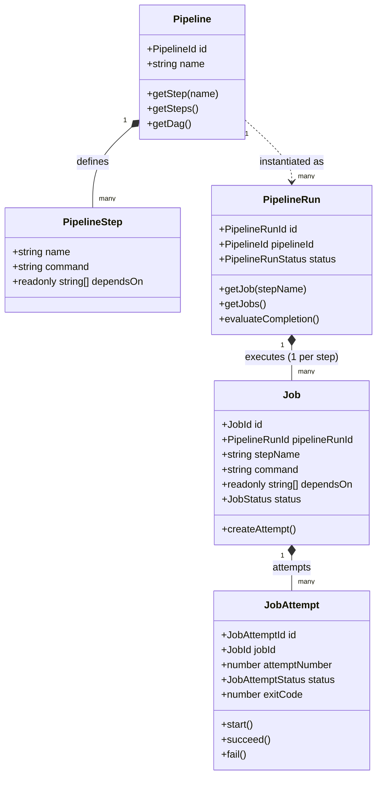
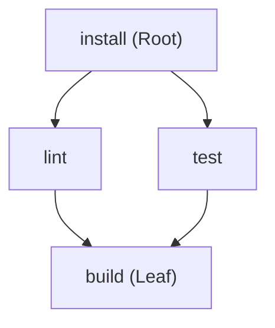
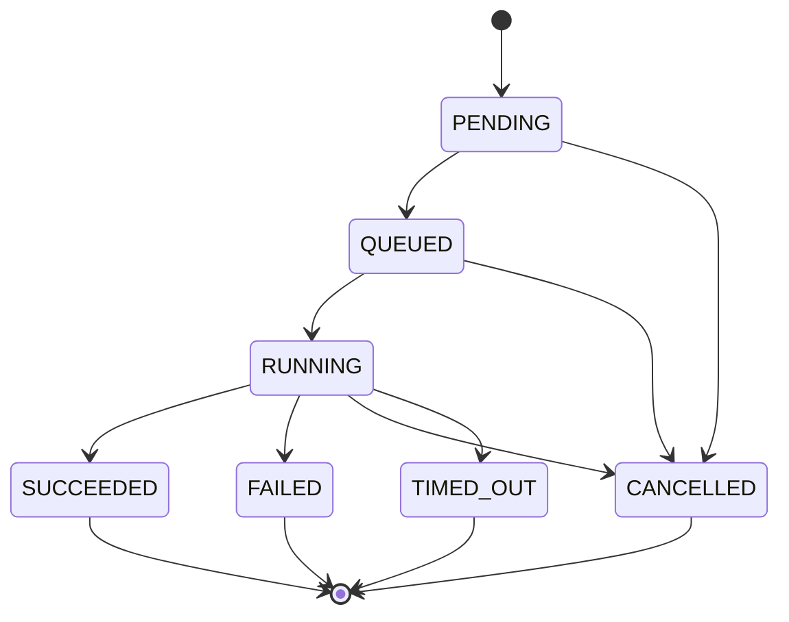
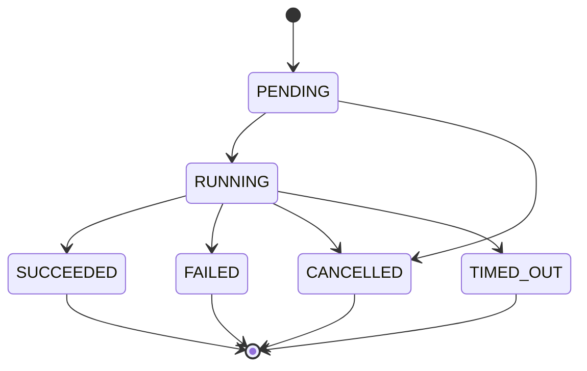

# Forge V2 — Domain Model & State Machines Specification

This document details the core in-memory domain model for **Forge V2**, established in **PR 03**.

The domain layer resides in `@forge/pipeline` and is strictly decoupled from storage (PostgreSQL), queues (Redis), container runtimes (Docker/Kubernetes), and networking (HTTP/WebSockets).

---

## 1. Domain Entities & Hierarchy

### Entity Responsibilities

1. **`Pipeline`**:
   - Reusable, static workflow definition.
   - Encapsulates an ordered list of `PipelineStep` instances and the compiled `DirectedAcyclicGraph`.
   - Enforces structural validation during instantiation (unique step names, non-empty commands, dependency resolution, cycle prevention).

2. **`PipelineStep`**:
   - Declaration of a single command within a pipeline.
   - Holds the command as unexecuted data and a list of upstream prerequisite step names (`dependsOn`).

3. **`PipelineRun`**:
   - An execution instance of a `Pipeline`.
   - Holds a deterministic 1:1 collection of `Job` instances corresponding directly to the pipeline's steps.
   - Manages the top-level run lifecycle and evaluates overall completion based on constituent job outcomes.

4. **`Job`**:
   - The execution unit of a single `PipelineStep` within a specific `PipelineRun`.
   - Tracks current status and owns the ordered history of physical execution attempts (`JobAttempt`).
   - Spawns new attempts for retries without rewriting historical attempts.

5. **`JobAttempt`**:
   - A single, physical execution attempt of a `Job`.
   - Identified by a unique attempt ID and a strictly sequential, incrementing `attemptNumber` ($1, 2, 3, \dots$).
   - Captures execution timestamps, terminal exit codes, and failure reasons.

---

## 2. Directed Acyclic Graph (DAG) Semantics

Dependencies between pipeline steps form a finite directed graph:

### Graph Properties & Rules

- **Roots**: Nodes with zero upstream dependencies (e.g., `install`). These are immediately eligible to run when a pipeline begins.
- **Leaves**: Nodes with zero downstream dependents (e.g., `build`).
- **Cycle Prevention**: Validated via Depth-First Search (DFS). If a circular dependency is detected (e.g., $A \to B \to C \to A$), instantiation fails with `CycleDetectedError` reporting the exact cycle path.
- **Self-Dependency Rejection**: Nodes depending on themselves immediately trigger `SelfDependencyError`.
- **Missing Dependency Rejection**: Dependencies referencing undeclared step names trigger `MissingDependencyError`.

### Deterministic Topological Ordering

To ensure absolute reproducibility across different environments, DAG operations must not rely on engine iteration orders. Forge implements Kahn's algorithm with an explicit tie-breaking rule:

> **Tie-Breaking Rule**: When multiple nodes have zero remaining unresolved dependencies simultaneously, they are processed in **lexicographical (alphabetical) order** by step name.

### Readiness Evaluation

A step is considered **ready** if and only if:

1. It has not already completed.
2. All of its direct upstream dependencies are present in the set of completed steps.

_(Note: The DAG evaluates eligibility as pure graph logic; it does not assign workers, queue tasks, or manage priorities.)_

---

## 3. State Machines & Lifecycle Rules

All lifecycle transitions in Forge are strictly controlled and validated. Direct mutation of status fields is prohibited.

### Pipeline Run State Machine

### Job State Machine

### Job Attempt State Machine

---

## 4. Terminal State Immutability

In strict accordance with **ADR-004 (At-Least-Once Delivery & Idempotent State Transitions)**:

1. The states `SUCCEEDED`, `FAILED`, `CANCELLED`, and `TIMED_OUT` are **terminal**.
2. Once an entity enters a terminal state, it can **never** transition back to an active lifecycle state (`PENDING`, `QUEUED`, `RUNNING`).
3. Attempting to transition out of a terminal state throws `InvalidStateTransitionError`.
4. Re-applying the current terminal status is treated as an idempotent no-op.
5. **Retries never mutate completed attempts**. A retry generates a brand-new `JobAttempt` with incremented `attemptNumber` and a distinct ID.

---

## 5. Pipeline Run Completion Derivation

The overall status of a `PipelineRun` is derived deterministically from its constituent jobs:

- **SUCCEEDED**: If and only if **all** jobs in the run have transitioned to `SUCCEEDED`.
- **FAILED**: If **any** job in the run transitions to `FAILED` or `TIMED_OUT`.
- **CANCELLED**: If any job is `CANCELLED` and no jobs have failed.
- **RUNNING**: While jobs remain in `PENDING`, `QUEUED`, or `RUNNING` without failures.

---

## 6. Domain Error Taxonomy

All domain errors inherit from `PipelineDomainError`:

| Error Class                   | Trigger Scenario                                                        |
| :---------------------------- | :---------------------------------------------------------------------- |
| `PipelineValidationError`     | General pipeline validation failure (empty names, empty commands, etc.) |
| `DuplicateStepError`          | Two steps declare the same step name within one pipeline                |
| `MissingDependencyError`      | A step depends on a step name that does not exist in the pipeline       |
| `SelfDependencyError`         | A step declares a dependency on itself                                  |
| `CycleDetectedError`          | A circular dependency chain is discovered during DAG resolution         |
| `InvalidStateTransitionError` | An illegal transition or terminal state mutation is attempted           |
| `DuplicateJobError`           | Attempt to register two jobs for the same step within one pipeline run  |
